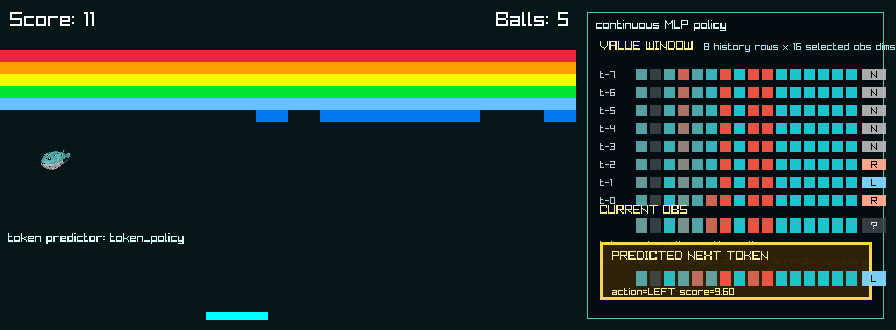

# Tokamech

Tokamech experiments with next-token prediction for control. PufferLib exports observation/action trajectories, Tokamech turns them into observation/action tokens, and an autoregressive token predictor sends the predicted action back into the live PufferLib environment.

