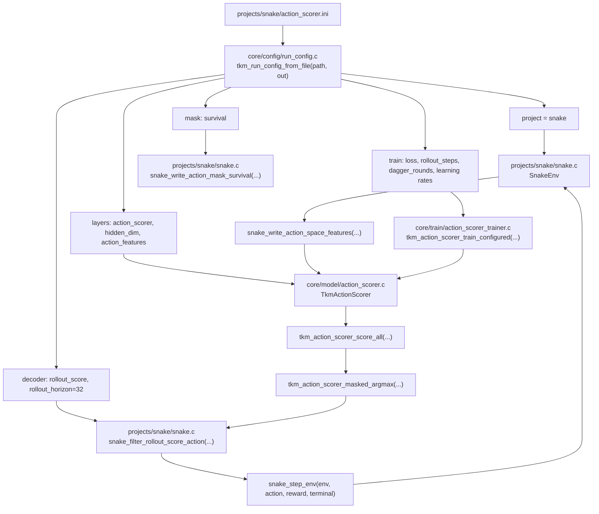
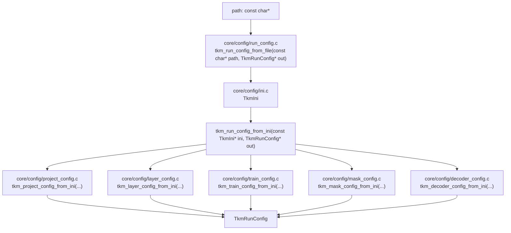
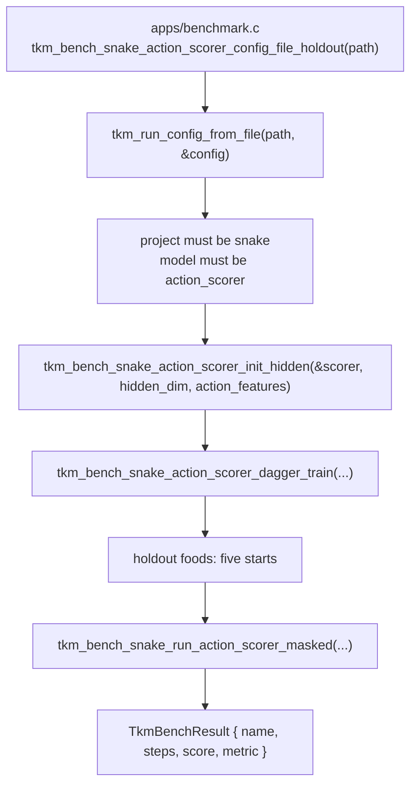
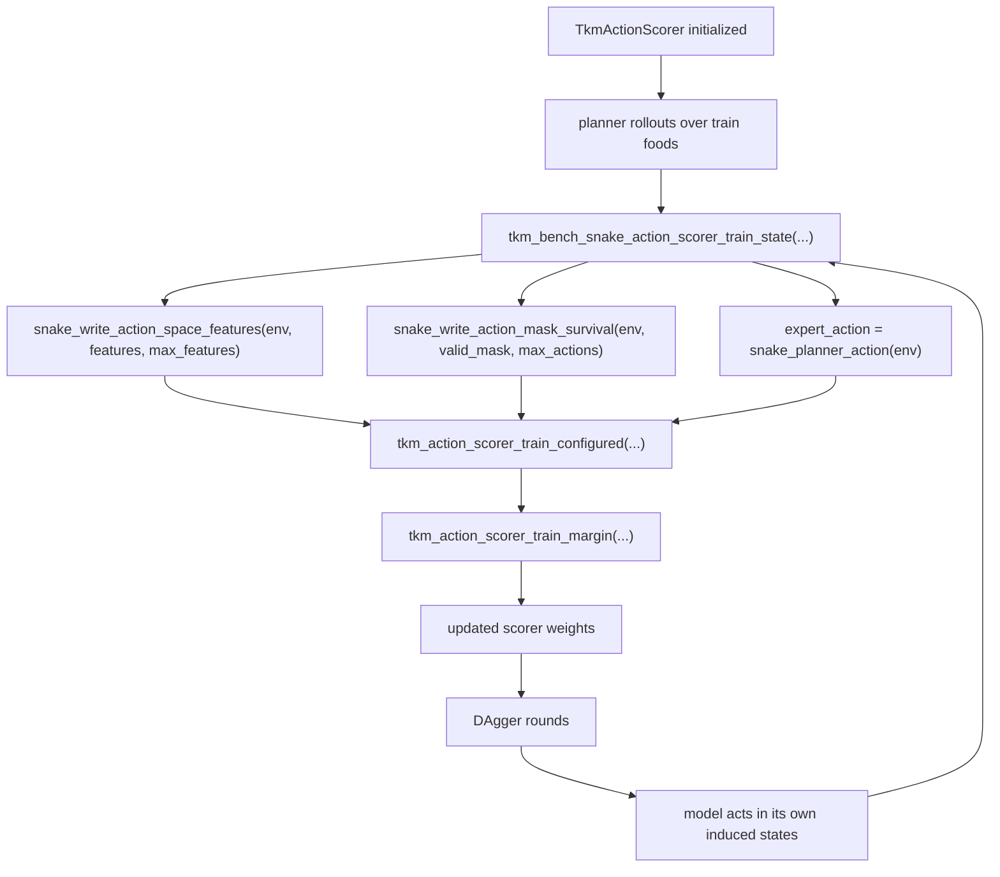
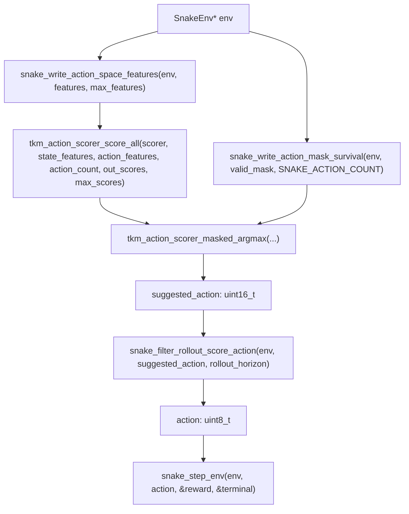
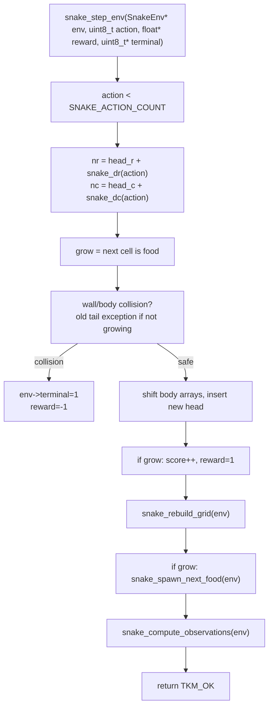
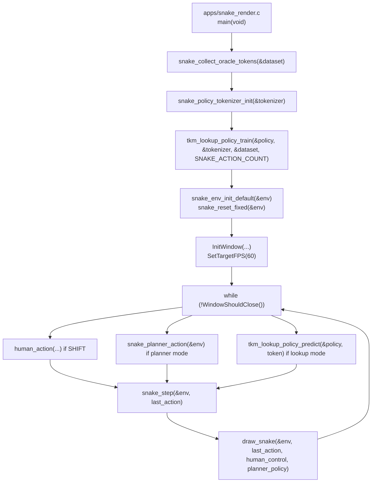
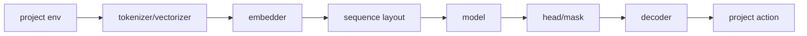

# Tokamech software flowchart

Date: 2026-07-06

This document shows how the current software works end to end, with the current strongest Snake path as the concrete example.

Current Snake config:

```ini
# projects/snake/action_scorer.ini
[project]
name = snake

[model]
kind = action_scorer
hidden_dim = 32
action_features = space

[train]
loss = margin
rollout_steps = 96
dagger_rounds = 4
learning_rate = 0.01
dagger_learning_rate = 0.005

[mask]
strategy = survival

[decoder]
fallback = rollout_score
rollout_horizon = 32
```

## Top-level flow



Summary:

1. The INI file selects the project, model, trainer settings, mask strategy, and decoder fallback.
2. `TkmRunConfig` combines all config sections into one struct.
3. Snake generates continuous state/action features.
4. The action scorer trains from planner labels and DAgger-style policy states.
5. At runtime, the model scores each candidate action.
6. The survival mask removes unsafe actions.
7. `rollout_score` simulates short futures and picks the action with the best projected result.
8. `snake_step_env` applies the action and updates the environment state.

## Config parsing flow



Key types:

| File | Type | Fields used by current Snake path |
| --- | --- | --- |
| `core/config/run_config.h` | `TkmRunConfig` | `project`, `layers`, `train`, `mask`, `decoder` |
| `core/config/project_config.h` | `TkmProjectConfig` | `project = TKM_PROJECT_SNAKE` |
| `core/config/layer_config.h` | `TkmLayerConfig` | `model`, `model_hidden_dim`, `action_features` |
| `core/config/train_config.h` | `TkmTrainConfig` | `loss`, `rollout_steps`, `dagger_rounds`, `learning_rate`, `dagger_learning_rate` |
| `core/config/mask_config.h` | `TkmMaskConfig` | `strategy = TKM_MASK_STRATEGY_SURVIVAL` |
| `core/config/decoder_config.h` | `TkmDecoderConfig` | `fallback = TKM_DECODER_FALLBACK_ROLLOUT_SCORE`, `rollout_horizon = 32` |

Important signatures:

```c
int tkm_run_config_from_ini(const TkmIni* ini, TkmRunConfig* out);
int tkm_run_config_from_file(const char* path, TkmRunConfig* out);
int tkm_layer_config_from_ini(const TkmIni* ini, TkmLayerConfig* out);
int tkm_train_config_from_ini(const TkmIni* ini, TkmTrainConfig* out);
int tkm_decoder_config_from_ini(const TkmIni* ini, TkmDecoderConfig* out);
```

## Current Snake benchmark flow



Important signatures:

```c
typedef struct {
    const char* name;
    uint32_t steps;
    int score;
    uint32_t metric;
} TkmBenchResult;

TkmBenchResult tkm_bench_snake_action_scorer_config_file_holdout(const char* path);
TkmBenchResult tkm_bench_snake_action_scorer_config_file_long_holdout(const char* path);
```

Current benchmark evidence:

```text
snake_action_scorer_config_file_holdout steps=480 score=131 metric=131
snake_action_scorer_config_file_long_holdout steps=1200 score=255 metric=255
```

## Snake training flow



Important signatures:

```c
int tkm_action_scorer_train_configured(
    TkmActionScorer* scorer,
    TkmTrainLossKind loss,
    const float* state_features,
    const float* action_features,
    const uint8_t* valid_mask,
    uint32_t action_count,
    uint16_t target_action,
    float margin,
    float learning_rate
);

int tkm_action_scorer_train_margin(
    TkmActionScorer* scorer,
    const float* state_features,
    const float* expert_action_features,
    const float* other_action_features,
    float margin,
    float learning_rate
);
```

Step summary:

1. Training starts from deterministic seeded scorer weights.
2. The Snake planner supplies expert actions.
3. `snake_write_action_space_features` writes one state vector plus one row per action.
4. `snake_write_action_mask_survival` marks actions that keep enough reachable space.
5. Margin loss pushes the expert action score above valid alternatives.
6. DAgger repeats training on states reached by the model itself.

## Snake inference flow



Important signatures:

```c
int snake_write_action_space_features(const SnakeEnv* env, float* out_features, uint32_t max_features);
int snake_write_action_mask_survival(const SnakeEnv* env, uint8_t* out_mask, uint32_t max_actions);

int tkm_action_scorer_masked_argmax(
    const TkmActionScorer* scorer,
    const float* state_features,
    const float* action_features,
    const uint8_t* valid_mask,
    uint32_t action_count,
    uint16_t* out_action
);

uint8_t snake_filter_rollout_score_action(const SnakeEnv* env, uint8_t suggested_action, uint32_t horizon);
```

Step summary:

1. The current environment state becomes continuous features.
2. Each action gets its own action feature row.
3. The model scores all four Snake actions.
4. The action mask removes immediate/survival-unsafe actions.
5. Masked argmax selects the model's best remaining action.
6. `rollout_score` simulates each first action plus planner continuation for `rollout_horizon`.
7. The decoder chooses the best projected action and the environment steps.

## Snake environment step flow



Important signatures:

```c
void snake_env_init_default(SnakeEnv* env);
void snake_reset_fixed(SnakeEnv* env);
void snake_rebuild_grid(SnakeEnv* env);
void snake_compute_observations(SnakeEnv* env);
int snake_step_env(SnakeEnv* env, uint8_t action, float* reward, uint8_t* terminal);
int snake_step(SnakeEnv* env, uint8_t action);
```

Key type:

```c
typedef struct {
    int width;
    int height;
    uint8_t grid[SNAKE_MAX_CELLS];
    int16_t observations[SNAKE_OBS_SIZE];
    uint8_t actions[SNAKE_ACTION_COUNT];
    int16_t body_r[SNAKE_MAX_CELLS];
    int16_t body_c[SNAKE_MAX_CELLS];
    int length;
    int head_r;
    int head_c;
    int food_r;
    int food_c;
    uint8_t dir;
    int score;
    uint32_t tick;
    uint8_t terminal;
} SnakeEnv;
```

## Renderer flow



Important renderer functions:

```c
int main(void);
static uint8_t human_action(uint8_t fallback);
static void draw_snake(const SnakeEnv* env, uint8_t action, uint8_t human_control, uint8_t planner_policy);
```

Renderer summary:

1. The renderer trains a tiny lookup policy from oracle tokens for demonstration.
2. It loads `projects/snake/action_scorer.ini` and defaults to the configured decoder policy.
3. Holding SHIFT gives human control.
4. Pressing T cycles `config`, `planner`, and `lookup` policy modes.
5. Pressing R resets the environment.

## Interchangeable layer seams



Current implemented options include:

| Layer | Examples |
| --- | --- |
| Tokenizer/vectorizer | `int_bins`, `vq_code`, `raw_continuous`, `normalized_continuous` |
| Embedder | `none`, `lookup`, `linear` |
| Sequence layout | `obs_action_interleaved`, `joint_transition` |
| Model | `lookup_policy`, `ngram`, `mlp_window`, `sparse_lookup`, `nearest_policy`, `linear_policy`, `action_scorer` |
| Head/mask | categorical scoring, masked argmax, immediate mask, survival mask |
| Loss/trainer | cross entropy, masked cross entropy, margin |
| Decoder | `none`, `planner_score`, `best_score`, `rollout_score` |

The important design rule is that project-specific knowledge stays at the project boundary. Core can own generic parsers, model code, trainers, buffers, losses, and heads. Snake owns Snake state, Snake features, Snake masks, Snake planner logic, and Snake rollout fallback logic.
